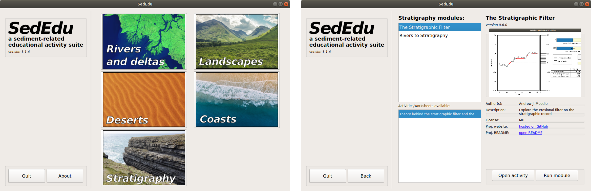

# Summary
SedEdu is a software framework that organizes computer-based interactive educational activities for sedimentology and stratigraphy courses.
Modules are coupled with activities that guide students by incrementally introducing components of a concept, and testing for understanding throughout the activity.
The modules are computational and quantitative, but the code is abstracted through a graphical user interface (GUI), through which the user interacts with aspects of the computational model.
This paper focuses on the SedEdu software, and not the underlying modules, and so describes the high level functionality of the SedEdu software package, includes a statement of need for this software package, and provides a brief example of how the SedEdu software has been integrated into a classroom.

The SedEdu framework organizes modules into five categories (Figure 1, left): "Rivers and deltas", "Landscapes", "Deserts", "Coasts", and "Stratigraphy".
Clicking on a category button brings the user to that category page, where the available modules (and associated metadata and activities) are listed (Figure 1, right).
Pressing the button "Run module" will launch the module selected, and "Open activity" will open the activity on the users computer (typically a `.pdf` file).

SedEdu is built on PyQt5, and is platform-agnostic, free, fully open source, and available from common software repositories (e.g., `pip`, `conda`).
SedEdu utilizes `gitsubmodule`s and continuous integration to package the educational modules, with the goal of making it convenient for users to install, access, and use the software. 
Modules are developed by individuals, utilizing existing Python libraries, thereby minimizing the development and maintenance burden for SedEdu contributors. 
Robust developer instructions included in the repository describe the workflow to develop and integrate a module into SedEdu.
The SedEdu software is independent of the underlying geologic content material, such that the software may be adapted (i.e., forked) for use in other fields or communities.
The SedEdu software framework was developed by Andrew J. Moodie, and modules and/or activities have been contributed by Brandee Carlson, Brady Foreman, Andrew Moodie, Kensuke Naito, Jeffrey Kwang, and Jeffrey Nittrouer; there are 7 modules and 7 activities/worksheets in the (current) version v1.1.10, and SedEdu is actively seeking developers of modules and activities.

# Statement of need
Active learning strategies improve student exam performance, engagement, attitudes, thinking, writing, self-reported participation and interest, help students become better acquainted with one another, and reduce the achievement gap that exists between underrepresented minority (URM) students and non-URM students [@prince_does_2004; @haak_increased_2011]. 
Active learning is broadly considered any strategy that breaks up traditional lecture-format teaching with engaging activities that focus on developing students' higher-order cognitive skills [@haak_increased_2011; @karahoca_computer_2010].
Ideal active learning strategies minimize financial thresholds for entry and maximize availability [@tekian_review_2004; @haak_increased_2011].
Thus, on-line and computer-based learning coupled with in-person lessons, called "blended learning", is a promising avenue to integrate active learning into the classroom [@garrison_blended_2004].
Active learning activities that can be used in undergraduate Sedimentology/Stratigraphy and Geomorphology courses are especially needed.

Separately, research and education integration is a core strategy in the U.S.A. National Science Foundation program design [@nsf_merit_2002], so grant writers frequently develop active learning strategies as part of their broader research impacts.
When developed, these active learning materials are often ineffectively disseminated, and so they are underutilized.
There is a need for a framework that distributes active learning modules, so that these materials are better incorporated into course work, and utilization of these externally-funded active learning materials is increased.

SedEdu is beneficial for educators because it organizes high-quality active learning materials that can be easily integrated into their classrooms, and it provides educational infrastructure in line with universal design for instruction principles [@scott_universal_2003].
SedEdu is beneficial for researchers because it provides a tractable pathway for broader research impacts, and because developing activities for computer-based active learning takes advantage of existing knowledge and skills researchers are likely to already possess (research and education integration).

# Using SedEdu in the classroom
Integrating educational infrastructure into the classroom is challenging, in part, due to logistical considerations for installing software; these concerns are alleviated with SedEdu's simple installation procedure, which is described in the project repository documentation.
Most SedEdu modules will be used in a similar manner, so this section provides the reader with a sense for how the SedEdu software and a module have been successfully integrated into a classroom.
*rivers2stratigraphy* (*r2s*, Figure 2) is an example of a SedEdu module that illustrates basin-scale development of fluvial (i.e., river) stratigraphy via a real-time, rules-based model.
The model simplifies a real-world system so to run efficiently, and yet produces realistic stratigraphic patterns. 
In the module GUI, the students may change system parameters that represent the types of boundary conditions interpreted by geologists when evaluating the rock record (e.g., channel water discharge, avulsion timescale, and basin subsidence rates). 
Thus, hypotheses regarding how certain conditions influence stratigraphic patterns over time and space can be sequentially tested. 

{width=400px}

This interactive approach improves on traditional static instruction methods taught in laboratories, wherein students are provided an outcrop photograph and asked to measure properties including channel stacking, sand-body thickness, and cross-cutting relationships. 
In these situations, interpretations are subjective and typically vary; moreover, this style requires spatial abstraction and visualization skills, even before students learn about how dynamic boundary conditions and various geological processes impact stratigraphic patterns. 
However, in the SedEdu *r2s* module, these hurdles are eliminated because the students interact in real-time with the key boundary conditions, evaluating how stratigraphy is influenced, which enables students to learn quickly and efficiently.

# References
