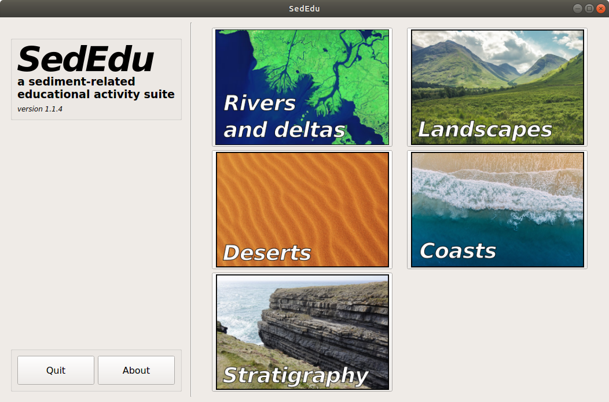

# SedEdu

SedEdu is a suite of educational activities related to geomorphology and sedimentology. 
The suite is targeted at grade school educators who want to bring engaging, interactive, and scientifically relevant activities into their classroom. 
SedEdu is built __entirely in Python and is free and open source__ software. 
Modules included in SedEdu are built by researchers at the cutting edge of their fields and are designed to showcase their research in a digestible manner.


    


## Getting Started

These instructions will get you a copy of the project up and running on your local machine for use in the classroom. 
See [Contributing to SedEdu](#contributing-to-sededu) for information on becoming a part of the SedEdu project.


### Installing dependencies

SedEdu runs in Python 3 and utilizes PyQt5 for rendering the graphical user interface. 
Modules included in SedEdu rely on `scipy`, `matplotlib`, `pygame`, and `shapely`. 
You can check your Python version by running: 

```
python3 -V
```

in a terminal. Note that you may need to specify the path to your Python executable on some systems.
If you do not have Python 3 installed, you will need to do so to use SedEdu. This will not disrupt an existing Python 2.x installation, if you rely on that for other uses.

It is recommended that you install Anaconda, which is an open source distribution of Python. 
It comes with many basic scientific libraries, some of which are used in the module. 
Anaconda can be downloaded at https://www.anaconda.com/download/ for Windows, macOS, and Linux. 
Please follow the instruction provided in the website as to how to install and setup Python on your computer.

If you want a more flexible and lightweight Python distribution, you can use whatever your favorite package manager is distributing (e.g., `homebrew` or `apt`), check the [Windows downloads here](https://www.python.org/downloads/windows/), or compile [from source](https://www.python.org/downloads/source/). 
If you go this route, you will need to also install `pip3`, PyQt5 (`python3-pyqt5`), and the dependency python packages listed below. 

It is recommended you install the needed dependencies through `pip3`.

Install the needed python3 system libraries:

```
sudo apt install python3 
```

Install the needed python3 packages:

```
pip3 install pyqt5 scipy numpy matplotlib pygame shapely
```

Install PyQt5:

```
sudo apt install python3-pyqt5
```


### Installing SedEdu

Eventually SedEdu will be packaged and deployed on [PyPi the Python Package Index](https://pypi.python.org/pypi) and can be installed seamlessly through `pip`.
This will allow a launcher/executable to be added to the host OS, making launching the application very easy.
Importantly, it also makes it easy for the SedEdu authors to deploy updates and bug fixes to your SedEdu installation.

For now though (see [milestone](https://github.com/amoodie/sededu/issues?q=is%3Aopen+is%3Aissue+milestone%3A%22Package+for+deployment+on+Pypi%22)), SedEdu must be installed by cloning the GitHub git repository.

You can clone the git repository to get the latest release version with:

```
git clone --recurse-submodules -b release https://git@github.com/amoodie/sededu.git
```

and SedEdu is then run with:

```
python3 sededu/run_sededu.py
```

<!-- 
#### Windows instructions
#### Mac OSX instructions
#### Linux instructions
-->

#### Troubleshooting

* __SedEdu won't launch:__ you're probably missing some Python or PyQt dependencies. 

* __There are no modules in SedEdu:__ you probably didn't get the submodules when you `git clone`d. Try `git submodule update --init --recursive` inside the cloned repository.

#### Developers

You should get the entire repository and work off of the `develop` branch:

```
git clone --recurse-submodules https://github.com/amoodie/sededu.git
git checkout -b <name-of-working-branch> develop
```

If you have already `git clone`d and need to pull the submodules now try:

```
git submodule update --init --recursive
```

See [CONTRIBUTING.md](https://github.com/amoodie/sededu/blob/release/CONTRIBUTING.md) for more information on the preferred `git` workflow for SedEdu, including a note on hot-fixes.


## Contributing to SedEdu

The SedEdu project needs contributions from the community to be successful.
However, there are __many different ways you can contribute!__
You do not even need to write code to contribute to SedEdu.
Some opportunities for contributions are listed below (in no particular order):

* write (code) a standalone interactive module
* write an activity for an existing module
* write (code) features and bug fixes for existing modules
* write (code) features and bug fixes for SedEdu
* write documentation for SedEdu

Please read [CONTRIBUTING.md](https://github.com/amoodie/sededu/blob/release/CONTRIBUTING.md) for details on our code of conduct, and the process for contributing to SedEdu (which includes any pull request).


## Authors

* **Andrew J. Moodie** - *3 modules* - [github.com/amoodie](https://github.com/amoodie)
* **Kensuke Naito** - *1 module* - [github.com/kensukename2](https://github.com/kensukename2)
* **Jeffrey Kwang** - *1 module* - [github.com/jeffskwang](https://github.com/jeffskwang)

See also the list of [contributors](https://github.com/amoodie/sededu/graphs/contributors) who have participated in this project in other ways.


## License

This project is licensed under the GNU GPL License - see the [full license](https://github.com/amoodie/sededu/blob/release/LICENSE.md) file for details.
It is provided without warranty or guaranteed support.
Each submodule may be licensed under a different license, please see the relevant module's license file, README, or project homepage for more information.


## Acknowledgments

The SedEdu framework was created by Andrew J. Moodie but has been built through the efforts of many authors (see Authors above).
The authors have been supported by:
* The US National Science Foundation under Grant Nos. 1427262 and 1450681.


## Disclaimer

Any opinion, findings, and conclusions or recommendations expressed in this material are those of the author(s) and do not necessarily reflect the views of any funding agency.